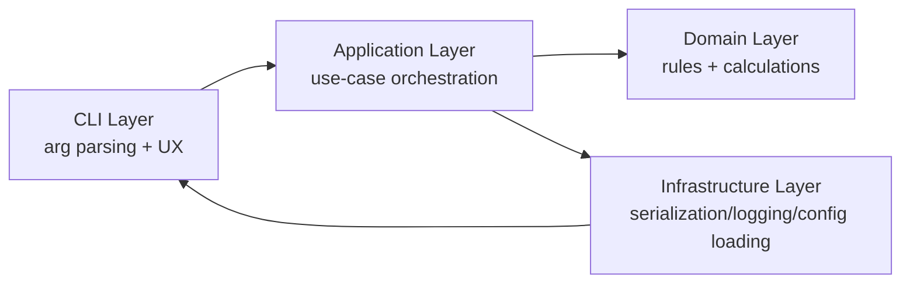

# ARCHITECTURE --- `mealplan` (Python CLI)

## 1. Purpose & Scope
- Architectural goals:
  - Provide deterministic, reproducible nutrition calculations from explicit CLI inputs.
  - Keep business rules testable and isolated from CLI and IO concerns.
  - Support stable JSON output for automation workflows.
- System boundaries:
  - In scope: input parsing, validation, calculation engine, periodization logic, JSON/plain output.
  - Out of scope: cloud APIs, persistent user accounts, wearable integrations, remote telemetry.
- Responsibilities:
  - This CLI is responsible for stateless computation and result formatting.
  - This CLI is not responsible for meal recipe generation, grocery planning, or coaching advice.
- Design constraints:
  - Offline-first execution.
  - Deterministic output for identical input.
  - No hidden mutable global state.
  - No cloud dependency for core functionality.

## 2. High-Level Architecture Overview

- Component responsibilities:
  - CLI: parse args, call use cases, map exceptions to exit codes, render output.
  - Application: coordinate validation + domain services, return response DTOs.
  - Domain: entities, value objects, invariants, deterministic calculation logic.
  - Infrastructure: config file/env loading, JSON/schema adapters, logging setup.
- Data flow overview:
  - User args -> validated request DTO -> domain computations -> response DTO -> output formatter.
- Control flow overview:
  - `main()` -> command handler -> use-case service -> calculation engine -> formatter -> exit code.
- Separation of concerns:
  - Domain does not import CLI/infrastructure.
  - CLI has no business logic beyond presentation and command wiring.

## 3. Architectural Principles
- Determinism: no randomness, no time-based defaults in calculations, stable ordering for meal allocation.
- Explicit IO: all inputs come from CLI/config; all outputs returned as DTOs then rendered.
- Pure domain functions: domain services are side-effect free.
- Idempotency: same input payload always yields same output payload.
- Dependency direction: `cli -> application -> domain`; infrastructure is adapter-only.
- No circular imports: enforce via module conventions and import lints.
- CLI thin, domain thick: logic in domain/application, not command functions.

## 4. Project Structure
```text
mealplan/
  pyproject.toml
  uv.lock
  README.md
  docs/
    PRD.md
    ARCHITECTURE.md
    MODEL.md
    adr/
  src/mealplan/
    cli/
    application/
    domain/
      models/
      services/
      rules/
    infrastructure/
      config/
      logging/
      output/
      validation/
    shared/
      errors.py
      types.py
  tests/
    unit/
    integration/
    cli/
    golden/
```
- Module boundaries:
  - `cli/` may import `application` and `shared` only.
  - `application/` may import `domain`, `shared`, and boundary interfaces.
  - `domain/` imports only stdlib + internal domain/shared types.
  - `infrastructure/` implements adapters; never imported by `domain`.
- Boundary restrictions:
  - No direct `cli -> domain` invocation.
  - No domain dependence on third-party frameworks.

## 5. CLI Layer Architecture
- Parsing strategy: `Typer` for command ergonomics and type-aware help.
- Command model:
  - Single main command (`mealplan`) with optional subcommands later (`calculate`, `validate-input`).
- Validation flow:
  - Parse primitive CLI inputs.
  - Convert to request DTO.
  - Run application-level validator (domain-safe constraints).
- Error flow:
  - Catch typed exceptions and map to exit codes.
  - Emit concise user message; optional `--debug` includes traceback.
- Output strategy:
  - Default JSON (machine-readable, stable keys).
  - Optional `--format table|text|json`, with JSON canonical for integrations.

## 6. Application Layer
- Responsibilities:
  - Orchestrate use cases (`calculate_plan`).
  - Enforce sequence: validate -> calculate energy/macros -> meal allocation -> response.
- Use-case service:
  - `MealPlanCalculationService` is stateless and deterministic.
- Request/response flow:
  - `CalculatePlanRequest` -> domain engine -> `CalculatePlanResponse`.
- State behavior:
  - Stateless runtime; no persisted mutable session state.
- DTOs:
  - Request DTO mirrors CLI schema.
  - Response DTO mirrors PRD JSON contract (`TDEE`, `training_carbs_g`, macros, `meals[]`).

## 7. Domain Model
- Canonical specification lives in [MODEL.md](/Users/Oliver.Koeth/work/mealplan-cli/docs/MODEL.md).
- Architecture-level view:
  - Domain services include energy calculator, macro calculator, periodization allocator, and meal splitter.
  - Domain contains entities/value objects and rule contracts, with all field-level constraints defined in `MODEL.md`.
  - Business boundary remains strict: domain expresses nutrition rules only; no CLI parsing or IO logic.

## 8. Calculation Engine
- Energy module:
  - Uses Mifflin-St Jeor with current defaults until height input is added.
  - Applies activity multiplier from PRD table.
- Macro module:
  - Protein fixed at `2g/kg`.
  - Carbs by mode: low `3g/kg`, normal `5g/kg`, periodized baseline `4g/kg`.
  - Fat as calorie remainder; reject negative fat.
- Training fueling:
  - All Z1 => `0g`; any zone >=2 => `60g/hour` over total duration.
- Periodization engine:
  - Applies two post-training high meals + remaining low distribution.
- Redistribution algorithm:
  - High meals fixed at 30% each of total carbs.
  - Remaining carbs split evenly over non-high meals.
- Precedence and deterministic ordering:
  - Meal order fixed: breakfast -> morning-snack -> lunch -> afternoon-snack -> dinner -> evening-snack.
  - Apply precedence from PRD section 8.5 exactly.

## 9. Periodization Strategy Design
- Approach: strategy pattern (`PeriodizationStrategy` interface, concrete `StandardPeriodizedStrategy`).
- Precedence hierarchy:
  - Non-periodized bypass.
  - Post-training rule.
  - Next-day high override unless explicit conflict.
  - Rebalance to exact total.
- Override logic:
  - Next-day high sets dinner high and evening-snack low, unless training-before is dinner/evening-snack.
- Conflict resolution:
  - Deterministic tie-breaking by precedence list, never implicit.
- Testability:
  - Strategy accepts immutable inputs, returns pure allocation map.

## 10. Data Contracts
- Input schema:
  - Canonical request DTO module path: `src/mealplan/application/contracts.py` (`MealPlanRequest`, `TrainingSession`).
  - Canonical enum module path: `src/mealplan/domain/enums.py` (import through `mealplan.domain.enums`).
  - `MealPlanRequest` exact fields: `age`, `gender`, `weight_kg`, `activity_level`, `carb_mode`, `training_load_tomorrow`, `training_session`.
  - `TrainingSession` exact fields: `zones_minutes`, `training_before_meal`.
  - Unknown fields are forbidden at every nesting level.
- Output schema:
  - Canonical response DTO module path: `src/mealplan/application/contracts.py` (`MealPlanResponse`, `MealAllocation`).
  - `MealPlanResponse` exact top-level fields: `TDEE`, `training_carbs_g`, `protein_g`, `carbs_g`, `fat_g`, `meals`.
  - `MealAllocation` exact fields: `meal`, `carbs_g`, `protein_g`, `fat_g`.
  - `meals[]` is serialized in canonical order only.
- Canonical meal order:
  - Single source: `src/mealplan/domain/model.py` `CANONICAL_MEAL_ORDER`.
  - Required order: `breakfast`, `morning-snack`, `lunch`, `afternoon-snack`, `dinner`, `evening-snack`.
  - Use this order in response DTO validation and all future allocation/output assembly code.
- Units naming policy:
  - Use explicit unit suffixes in DTO field names where applicable: `weight_kg`, `*_g`, and `*_minutes`.
  - `age` is expressed in years at the contract boundary (`MealPlanRequest.age`).
  - `TDEE` remains a legacy response key for compatibility and represents kcal/day.
- JSON schema:
  - Publish versioned JSON schema under `docs/schemas/mealplan-output.v1.json` (planned).
- Validation boundaries:
  - Phase 2 boundary: schema validation only (types, required fields, enum membership, unknown-field rejection, structural shape).
  - Phase 3 boundary: business-rule/semantic validation (for example: required-if-training-minutes>0 checks and nutrition rule invariants).
- Typing discipline:
  - Full type hints; `mypy` strict mode for domain/application packages.
- Valid request JSON example:
```json
{
  "age": 35,
  "gender": "male",
  "weight_kg": 72.5,
  "activity_level": "medium",
  "carb_mode": "periodized",
  "training_load_tomorrow": "high",
  "training_session": {
    "zones_minutes": {
      "1": 20,
      "2": 40,
      "3": 0,
      "4": 0,
      "5": 0
    },
    "training_before_meal": "lunch"
  }
}
```
- Valid response JSON example:
```json
{
  "TDEE": 2500.0,
  "training_carbs_g": 60.0,
  "protein_g": 145.0,
  "carbs_g": 290.0,
  "fat_g": 70.0,
  "meals": [
    {"meal": "breakfast", "carbs_g": 40.0, "protein_g": 24.0, "fat_g": 12.0},
    {"meal": "morning-snack", "carbs_g": 35.0, "protein_g": 20.0, "fat_g": 10.0},
    {"meal": "lunch", "carbs_g": 75.0, "protein_g": 32.0, "fat_g": 16.0},
    {"meal": "afternoon-snack", "carbs_g": 35.0, "protein_g": 20.0, "fat_g": 10.0},
    {"meal": "dinner", "carbs_g": 75.0, "protein_g": 32.0, "fat_g": 16.0},
    {"meal": "evening-snack", "carbs_g": 30.0, "protein_g": 17.0, "fat_g": 6.0}
  ]
}
```

## 11. Configuration Architecture
- Precedence:
  - CLI flags override config file values.
  - Config file overrides environment defaults.
- Environment variables:
  - Optional prefix `MEALPLAN_` for non-sensitive defaults (e.g., output format).
- Defaults:
  - Explicit default values documented and represented in DTO constructors.
- Config validation:
  - Parsed through typed config model at startup.
- Extensibility:
  - Reserve namespaced config sections for future engines/features.

## 12. Error Handling Strategy
- Exception hierarchy:
  - `MealPlanError` base, plus `ValidationError`, `DomainRuleError`, `ConfigError`, `OutputError`.
- Domain vs infrastructure errors:
  - Domain errors are rule violations; infrastructure errors are parse/render/runtime adapter issues.
- Exit codes:
  - `0` success, `2` validation/input error, `3` domain rule violation, `4` infrastructure/runtime failure.
- User vs debug output:
  - Human-readable single-line message by default.
  - `--debug` adds traceback and context payload.
- Fail-fast:
  - Stop on first unrecoverable invalid state; no silent fallback values.

## 13. Logging & Observability
- Logging framework:
  - stdlib `logging` with optional JSON formatter.
- Log levels:
  - `WARNING` default, `INFO` for operational visibility, `DEBUG` for trace mode.
- Structured logging:
  - Include request id (local), command, and calculation stage.
- Debug behavior:
  - Emit intermediate calculation steps when `--debug` enabled.
- Traceability:
  - Log key rule applications (e.g., selected high-carb meals) without exposing secrets.

## 14. Dependency Management
- Package/dependency manager:
  - Use `uv` exclusively for lock/install/sync.
  - Canonical commands: `uv sync`, `uv run mealplan ...`, `uv run pytest`.
- Approved external libraries (initial):
  - `typer` (CLI), `pydantic` (contracts/validation), `rich` (optional table output), `pytest` (tests).
- Dependency injection:
  - Constructor injection at application/infrastructure boundaries.
- Dependency rules:
  - No third-party dependencies inside `domain/` unless mathematically essential and approved via ADR.

## 15. Testing Architecture
- Unit boundaries:
  - Domain services/value objects tested in isolation.
- Domain-first tests:
  - Priority on energy/macro/periodization correctness.
- Integration tests:
  - Application service with in-memory adapters.
- CLI invocation tests:
  - End-to-end command tests via Typer test runner/subprocess.
- Golden-file tests:
  - Snapshot JSON outputs in `tests/golden/` for stable regression checks.
- Determinism tests:
  - Repeat-run assertions for identical input/output.
- Edge matrix:
  - Zones combinations, periodization conflicts, low/normal/periodized modes, invalid ranges.

## 16. Performance Considerations
- Runtime complexity:
  - O(1) for single plan calculation; fixed small meal set.
- Memory constraints:
  - Minimal; bounded to request/response payload.
- Startup time:
  - Keep imports lean; avoid heavy optional dependencies on default path.
- Scalability:
  - Batch mode possible via repeated invocation or future `--input-file` processing.

## 17. Security Considerations
- Input sanitization:
  - Strict enum/range checks for all CLI and config inputs.
- JSON parsing safety:
  - Use safe parser (`json.loads`) on trusted string arguments only.
- Code execution safety:
  - Never evaluate input (`eval`, dynamic import) from user payloads.
- Secrets handling:
  - No secrets currently required; if added, read from env and never log.

## 18. Extensibility Model
- New commands:
  - Add command module in `cli/commands`, register in root Typer app.
- New carb strategies:
  - Implement `PeriodizationStrategy` and register via application factory.
- New macro rules:
  - Add rule objects in `domain/rules` and compose in macro calculator.
- Plugin future:
  - Optional entry-point based plugin discovery (future ADR required).
- Versioning:
  - Version output schema and CLI behavior independently where needed.

## 19. Backward Compatibility Strategy
- CLI stability:
  - Existing flags remain compatible within major version.
- Deprecation policy:
  - Mark deprecated flags for at least one minor release before removal.
- Semantic versioning:
  - `MAJOR` for breaking CLI/output contract changes, `MINOR` for additive features, `PATCH` for fixes.

## 20. Packaging & Distribution
- Entry point:
  - Console script `mealplan = mealplan.cli.main:app`.
- Setup configuration:
  - `pyproject.toml` with PEP 621 metadata and optional dependency groups.
- Binary build:
  - Consider PyInstaller/PEX only if standalone distribution becomes required.
- Installation footprint:
  - Keep minimal runtime dependencies; isolate dev/test extras.

## 21. Documentation Strategy
- Help text:
  - Auto-generated command help from Typer type metadata and docstrings.
- Docstring policy:
  - Public modules/classes/functions include concise purpose + invariants.
- Markdown structure:
  - `docs/` contains PRD, architecture, model spec, ADRs, schemas, and usage examples.
- Examples:
  - Provide deterministic examples with fixed input/output pairs.

## 22. Anti-Patterns to Avoid
- Business logic in CLI functions.
- Hidden mutable module globals.
- Unnamed magic constants (use named rule constants).
- Implicit precedence behavior not encoded in tests.
- Hardcoded macro percentages outside rule definitions.

## 23. Future Architecture Evolution
- Height input extension:
  - Add `height_cm` to `UserProfile` and energy calculator without breaking request parser.
- Micronutrient engine:
  - Introduce separate domain service and response extension contract.
- Meal suggestion engine:
  - Optional module layered above macro outputs; keep core deterministic.
- API mode:
  - Reuse application/domain layers behind FastAPI adapter.
- Web wrapper:
  - CLI remains canonical engine; web UI calls same application services.

## 24. Architecture Decision Records (ADR)
- Decision documentation:
  - Record significant architecture choices as ADR markdown files.
- Location:
  - `docs/adr/` with sequential naming (`0001-...md`).
- Change approval:
  - New dependency, boundary relaxation, or contract change requires ADR + review.

## 25. Definition of Architectural Integrity
- No cross-layer imports that violate dependency direction.
- Domain test coverage threshold: >= 90% statement coverage for `domain/`.
- All business rules represented in executable code + tests (not prose-only comments).
- No silent fallbacks for invalid inputs, missing required fields, or impossible macro states.
